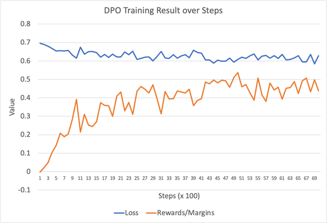

## Post training of model google/gemma-2b-it
### Base Model
google/gemma-2b-it

### Dataset
* UltraFeedback dataset: general-purpose preference data; diverse topic
https://huggingface.co/datasets/HuggingFaceH4/ultrafeedback_binarized/viewer/default/train_prefs?views%5B%5D=train_prefs
* Size: 61K
* Goal: human preference

### DPO training result
[dpo_train_human_preference.py](dpo_train_human_preference.py)

### DPO Evaluation on human preference

Metrics: Win Rate (Battle-style comparison)

### Perplexity 
output: [perplexity_out](eval_out/perplexity_out) 

script: [eval_perplexity.py](eval_perplexity.py)

## Alpaca-eval 
    python3 run_alpacaeval_local.py

Dataset: 
    https://huggingface.co/datasets/tatsu-lab/alpaca_eval/blob/main/alpaca_eval.json

## Human side by side eval
output: [manual_eval_candidates.json](manual_eval_candidates.json)

script: [human_eval.py](human_eval.py), 

## LM-Eval Harness (MMLU, TruthfulQA, etc.) 
This evaluates objective quality, but not human preference.

|                 Tasks                 |Version|Filter|n-shot|  Metric   |   | Value |   |Stderr|
|---------------------------------------|------:|------|-----:|-----------|---|------:|---|-----:|
|hellaswag                              |      1|none  |     0|acc        |↑  | 0.4922|±  |0.0050|
|                                       |       |none  |     0|acc_norm   |↑  | 0.6443|±  |0.0048|
|mmlu                                   |      2|none  |      |acc        |↑  | 0.3816|±  |0.0040|
| - humanities                          |      2|none  |      |acc        |↑  | 0.3552|±  |0.0069|
|  - formal_logic                       |      1|none  |     0|acc        |↑  | 0.3571|±  |0.0429|
|  - high_school_european_history       |      1|none  |     0|acc        |↑  | 0.5212|±  |0.0390|
|  - high_school_us_history             |      1|none  |     0|acc        |↑  | 0.4167|±  |0.0346|
|  - high_school_world_history          |      1|none  |     0|acc        |↑  | 0.5443|±  |0.0324|
|  - international_law                  |      1|none  |     0|acc        |↑  | 0.5207|±  |0.0456|
|  - jurisprudence                      |      1|none  |     0|acc        |↑  | 0.4907|±  |0.0483|
|  - logical_fallacies                  |      1|none  |     0|acc        |↑  | 0.3742|±  |0.0380|
|  - moral_disputes                     |      1|none  |     0|acc        |↑  | 0.4046|±  |0.0264|
|  - moral_scenarios                    |      1|none  |     0|acc        |↑  | 0.2413|±  |0.0143|
|  - philosophy                         |      1|none  |     0|acc        |↑  | 0.3505|±  |0.0271|
|  - prehistory                         |      1|none  |     0|acc        |↑  | 0.3858|±  |0.0271|
|  - professional_law                   |      1|none  |     0|acc        |↑  | 0.3129|±  |0.0118|
|  - world_religions                    |      1|none  |     0|acc        |↑  | 0.4620|±  |0.0382|
| - other                               |      2|none  |      |acc        |↑  | 0.4287|±  |0.0088|
|  - business_ethics                    |      1|none  |     0|acc        |↑  | 0.4400|±  |0.0499|
|  - clinical_knowledge                 |      1|none  |     0|acc        |↑  | 0.4113|±  |0.0303|
|  - college_medicine                   |      1|none  |     0|acc        |↑  | 0.3584|±  |0.0366|
|  - global_facts                       |      1|none  |     0|acc        |↑  | 0.2300|±  |0.0423|
|  - human_aging                        |      1|none  |     0|acc        |↑  | 0.4484|±  |0.0334|
|  - management                         |      1|none  |     0|acc        |↑  | 0.4854|±  |0.0495|
|  - marketing                          |      1|none  |     0|acc        |↑  | 0.5983|±  |0.0321|
|  - medical_genetics                   |      1|none  |     0|acc        |↑  | 0.3900|±  |0.0490|
|  - miscellaneous                      |      1|none  |     0|acc        |↑  | 0.4943|±  |0.0179|
|  - nutrition                          |      1|none  |     0|acc        |↑  | 0.4673|±  |0.0286|
|  - professional_accounting            |      1|none  |     0|acc        |↑  | 0.3227|±  |0.0279|
|  - professional_medicine              |      1|none  |     0|acc        |↑  | 0.3051|±  |0.0280|
|  - virology                           |      1|none  |     0|acc        |↑  | 0.3675|±  |0.0375|
| - social sciences                     |      2|none  |      |acc        |↑  | 0.4274|±  |0.0088|
|  - econometrics                       |      1|none  |     0|acc        |↑  | 0.2544|±  |0.0410|
|  - high_school_geography              |      1|none  |     0|acc        |↑  | 0.4495|±  |0.0354|
|  - high_school_government_and_politics|      1|none  |     0|acc        |↑  | 0.5026|±  |0.0361|
|  - high_school_macroeconomics         |      1|none  |     0|acc        |↑  | 0.3795|±  |0.0246|
|  - high_school_microeconomics         |      1|none  |     0|acc        |↑  | 0.3361|±  |0.0307|
|  - high_school_psychology             |      1|none  |     0|acc        |↑  | 0.5174|±  |0.0214|
|  - human_sexuality                    |      1|none  |     0|acc        |↑  | 0.4046|±  |0.0430|
|  - professional_psychology            |      1|none  |     0|acc        |↑  | 0.3824|±  |0.0197|
|  - public_relations                   |      1|none  |     0|acc        |↑  | 0.4000|±  |0.0469|
|  - security_studies                   |      1|none  |     0|acc        |↑  | 0.3837|±  |0.0311|
|  - sociology                          |      1|none  |     0|acc        |↑  | 0.5373|±  |0.0353|
|  - us_foreign_policy                  |      1|none  |     0|acc        |↑  | 0.5700|±  |0.0498|
| - stem                                |      2|none  |      |acc        |↑  | 0.3298|±  |0.0082|
|  - abstract_algebra                   |      1|none  |     0|acc        |↑  | 0.3000|±  |0.0461|
|  - anatomy                            |      1|none  |     0|acc        |↑  | 0.4074|±  |0.0424|
|  - astronomy                          |      1|none  |     0|acc        |↑  | 0.3750|±  |0.0394|
|  - college_biology                    |      1|none  |     0|acc        |↑  | 0.4514|±  |0.0416|
|  - college_chemistry                  |      1|none  |     0|acc        |↑  | 0.3100|±  |0.0465|
|  - college_computer_science           |      1|none  |     0|acc        |↑  | 0.3600|±  |0.0482|
|  - college_mathematics                |      1|none  |     0|acc        |↑  | 0.3200|±  |0.0469|
|  - college_physics                    |      1|none  |     0|acc        |↑  | 0.1863|±  |0.0387|
|  - computer_security                  |      1|none  |     0|acc        |↑  | 0.5000|±  |0.0503|
|  - conceptual_physics                 |      1|none  |     0|acc        |↑  | 0.3362|±  |0.0309|
|  - electrical_engineering             |      1|none  |     0|acc        |↑  | 0.4966|±  |0.0417|
|  - elementary_mathematics             |      1|none  |     0|acc        |↑  | 0.2460|±  |0.0222|
|  - high_school_biology                |      1|none  |     0|acc        |↑  | 0.4516|±  |0.0283|
|  - high_school_chemistry              |      1|none  |     0|acc        |↑  | 0.2808|±  |0.0316|
|  - high_school_computer_science       |      1|none  |     0|acc        |↑  | 0.3700|±  |0.0485|
|  - high_school_mathematics            |      1|none  |     0|acc        |↑  | 0.2185|±  |0.0252|
|  - high_school_physics                |      1|none  |     0|acc        |↑  | 0.2848|±  |0.0368|
|  - high_school_statistics             |      1|none  |     0|acc        |↑  | 0.2269|±  |0.0286|
|  - machine_learning                   |      1|none  |     0|acc        |↑  | 0.3214|±  |0.0443|
|truthfulqa_gen                         |      3|none  |     0|bleu_acc   |↑  | 0.4088|±  |0.0172|
|                                       |       |none  |     0|bleu_diff  |↑  |-2.0255|±  |0.5568|
|                                       |       |none  |     0|bleu_max   |↑  |18.5645|±  |0.6768|
|                                       |       |none  |     0|rouge1_acc |↑  | 0.4113|±  |0.0172|
|                                       |       |none  |     0|rouge1_diff|↑  |-2.8608|±  |0.7197|
|                                       |       |none  |     0|rouge1_max |↑  |41.2027|±  |0.8277|
|                                       |       |none  |     0|rouge2_acc |↑  | 0.2876|±  |0.0158|
|                                       |       |none  |     0|rouge2_diff|↑  |-4.2040|±  |0.8030|
|                                       |       |none  |     0|rouge2_max |↑  |24.9820|±  |0.8908|
|                                       |       |none  |     0|rougeL_acc |↑  | 0.3868|±  |0.0170|
|                                       |       |none  |     0|rougeL_diff|↑  |-3.2768|±  |0.7242|
|                                       |       |none  |     0|rougeL_max |↑  |38.4656|±  |0.8277|
|truthfulqa_mc1                         |      2|none  |     0|acc        |↑  | 0.2889|±  |0.0159|
|truthfulqa_mc2                         |      3|none  |     0|acc        |↑  | 0.4576|±  |0.0159|                       |      3|none  |     0|acc        |↑  | 0.4576|±  |0.0159|

|      Groups      |Version|Filter|n-shot|Metric|   |Value |   |Stderr|
|------------------|------:|------|------|------|---|-----:|---|-----:|
|mmlu              |      2|none  |      |acc   |↑  |0.3816|±  |0.0040|
| - humanities     |      2|none  |      |acc   |↑  |0.3552|±  |0.0069|
| - other          |      2|none  |      |acc   |↑  |0.4287|±  |0.0088|
| - social sciences|      2|none  |      |acc   |↑  |0.4274|±  |0.0088|
| - stem           |      2|none  |      |acc   |↑  |0.3298|±  |0.0082|